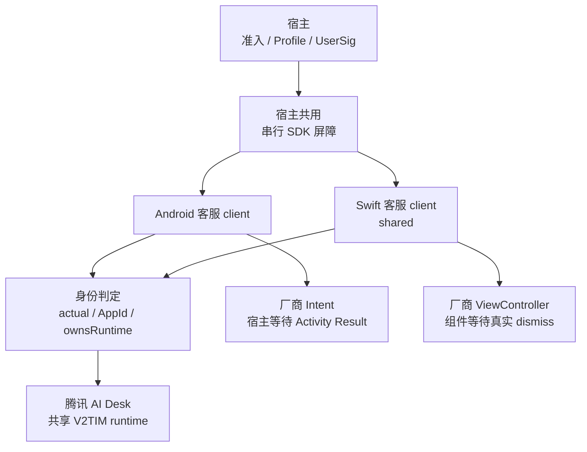
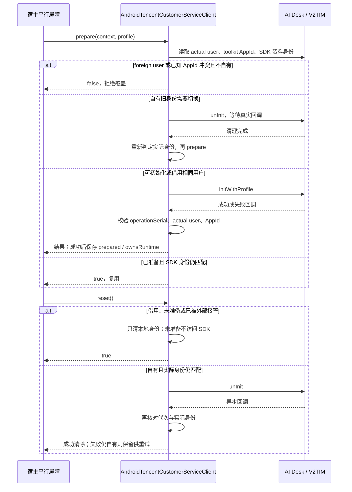
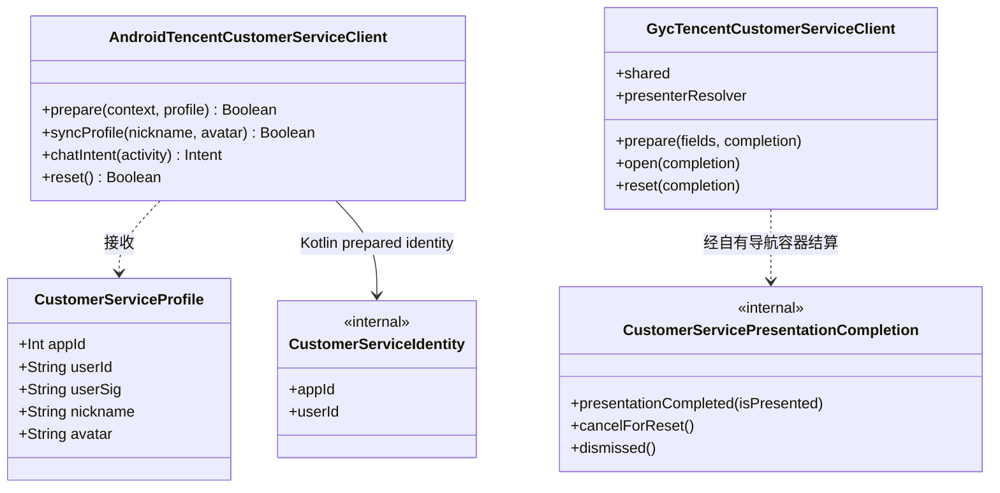

# GY CrossKit 腾讯客服适配

Android/iOS 腾讯 AI Desk 的最小原生适配：配置厂商 UI、准备账号、同步资料、取得或展示厂商聊天页面、清理自有身份。
聊天 UI 与资源全部使用厂商依赖，组件不复制 vendor 源码或资源。OHOS 没有实现，宿主继续报告 unsupported。

当前 Maven / Git Pod 固定版本 **0.1.5**：syncProfile在SDK回调后重新校验代次、实际身份和已知AppId，拒绝reset或外部接管后的迟到成功。**已发布，实际 Git Pod 厂商 SDK/App 链接及远程文件核验结果见完整审查**。上版0.1.4已发布，历史验收不代算候选。详见[完整源码审查](verification/完整源码审查.md)及[腾讯客服鸿蒙接入核查](verification/腾讯客服鸿蒙接入核查.md)。

## 架构与调用流程

宿主先完成业务准入并取得凭据，再通过进程级串行屏障调用组件；屏障由宿主与 Live 共用。组件区分「已准备身份」与「是否拥有 SDK runtime」，避免清理其他模块借给客服的 IM 登录。



下面画 Android 的准备与清理。prepare、syncProfile、reset 在 Main + NonCancellable 等待 SDK 真正回调；调用方取消自身等待也不能提前释放共用屏障。iOS 使用主线程 completion，遵循相同身份规则。



核心类型只列组件自己的类型；Android 读取 Kotlin `CustomerServiceProfile`，Swift `prepare` 接收对应字段，内部持有独立的同名 Swift `CustomerServiceIdentity`，并非图中的 Kotlin 类型。Swift 模态 completion 仅在真实关闭后结算，照片等子页面不能提前解锁；`reset` 先关闭自有模态页再判定 SDK 清理资格。



源码入口：[Kotlin 资料与身份判定](src/commonMain/kotlin/io/github/gycrosskit/customerservice/CustomerServiceProfile.kt)、[Android 原生适配器](src/androidMain/kotlin/io/github/gycrosskit/customerservice/AndroidTencentCustomerServiceClient.kt)、[Swift client](ios/Sources/GycCustomerServiceNative/GycTencentCustomerServiceClient.swift)、[Swift identity](ios/Sources/GycCustomerServiceNative/CustomerServiceOwnership.swift)、[真实 dismiss completion](ios/Sources/GycCustomerServiceNative/CustomerServicePresentationCompletion.swift)。OHOS 没有客服实现；页面等待、超时、业务结果与直播资料恢复由宿主负责。

## 安装与消费

包装代码使用 [Apache-2.0](LICENSE)；[GitHub 仓库](https://github.com/gycrosskit/customer-service) 通过不可变标签和 Release 发布。
KMP 坐标是 `com.github.gycrosskit.customer-service:customer-service:0.1.5`；Android 最低 API 24、iOS 原生最低 15.0。
KMP root 提供数据类型与 Android 原生适配器；iOS Swift 客户端单独用 `GycCustomerServiceNative` Pod，不要求宿主再导出未消费的 KMP Bridge。

```kotlin
// 在 dependencyResolutionManagement.repositories 中添加 maven("https://jitpack.io")。
implementation("com.github.gycrosskit.customer-service:customer-service:0.1.5")
```

```ruby
pod 'GycCustomerServiceNative', :git => 'https://github.com/gycrosskit/customer-service.git', :tag => '0.1.5'
```

本地验证先执行 `bash scripts/export-artifacts.sh`，解包 `build/release/customer-service-maven.tar.gz`
到独立临时 Maven 仓库，通过仓库外的 init script 对候选模块做精确 exclusiveContent；不用 `includeBuild`、源码替换或永久 `mavenLocal`。
iOS 正式验证从上面的 Git/tag Pod 下载 Swift 源码并编译独立消费工程；不使用本地 path。
当前 Maven/Git Pod `0.1.5` 的冻结归档、Release重下载和真实Git Pod/App链接核验通过，新Maven最终消费通过，结果见完整审查；上版0.1.4历史结果见 [发布验收](verification/发布验收.md)。AppId 使用保护与合法 borrow 的清理权限规则沿用既有实现；历史版本证据不代算新候选。
`jitpack-install.sh` 从同版本 GitHub Release 下载 Maven 归档并校验 SHA-256，供 JitPack 安装 macOS 产物。
归档不是宿主 Maven 地址；正式消费仍使用上面的 JitPack 坐标。

## 宿主边界

宿主先校验隐私、功能、门店绑定、账号、动态 AppId 与品牌回退，并提供 UserSig、客服昵称和头像。
Android 的进程唯一 `AndroidTencentCustomerServiceClient` 接收 `CustomerServiceProfile`，在主线程执行 SDK 操作；
`onSdkError` 交回 operation/code/message 供宿主原 Logger 记录，组件不引入日志框架。
组件用共享 V2TIM actual user 判定 runtime，prepared identity 与 ownsRuntime 分开：同目标用户已经由 Live 登录时可准备并借用，不取得 logout/unInit 权限；只有本组件从空 runtime 登录成功且实际用户仍匹配才清理。foreign 用户、已知 toolkit AppId 冲突拒绝覆盖，迟到成功回调再次校验实际用户与本地代次，失败且仍自有时保留归属。Android 不再把 Desk.hasLoginSuccess=false 误当成共享 IM 未登录。
未准备身份的 reset 直接成功，不访问厂商单例；iOS 仍先关闭本组件拥有的模态页，再决定是否需要 SDK 清理。
两端在异步 reset 成功后重新判定 SDK 实际用户，避免等待期间外部接管的账号被覆盖。

prepare、syncProfile、reset 是不可取消的厂商操作。宿主必须用进程级串行任务持有至 SDK 真正回调，
调用方超时或取消只结束自身等待，不能通过重建 client、创建第二 scope 或新会话绕过旧操作。Live 与客服必须复用宿主已有同一个 SDK 操作屏障；这是串行不可取消 native 调用，不能替代组件 actual/own/borrow 保护。
Android `chatIntent` 只取得原生页面，Activity Result 与重复打开等待由宿主持有。
iOS 唯一 `GycTencentCustomerServiceClient.shared` 接收最终活动容器的 `presenterResolver`，
展示厂商 ViewController，并在真实 dismiss 后回调；照片等全屏子页不提前解锁。
宿主只转发 native completion，继续负责业务结果、等待及直播资料恢复。

## 固定厂商依赖与来源

Android `com.tencentcloud.desk:aideskcustomer:2.6.0` 及其 Desk 2.6.0 组件；IM 固定 `imsdk-plus:9.1.7818`。
iOS `TencentCloudAIDeskCustomer:1.4.1`、TDesk 四组件 `2.9.141`、IM `TXIMSDK_Plus_iOS_XCFramework:9.1.7818`。
厂商通过 Maven/CocoaPods 原坐标取得，不嵌入归档，不替换聊天 UI。
Android 缓存 POM 的许可证字段是 Apache-2.0；iOS Podspec 与原 LICENSE 是 MIT。
本仓库包装代码使用 Apache-2.0；厂商依赖继续使用其原许可证及服务条款。
Release Maven 归档仅含本组件的 AAR/KLIB/metadata；Native 0.1.0 归档仅含本组件 Swift 源码、Podspec、README 和 LICENSE。

## 验证

```bash
bash gradlew testDebugUnitTest compileKotlinIosSimulatorArm64 publishAllPublicationsToStagingRepository
mkdir -p build/verification
swiftc ios/Sources/GycCustomerServiceNative/CustomerServiceOwnership.swift ios/Sources/GycCustomerServiceNative/CustomerServicePresentationCompletion.swift verification/main.swift -o build/verification/ownership-check
build/verification/ownership-check
```

独立消费工程见 `verification/gradle`，正式验证通过 exclusiveContent 仅从 JitPack 消费本组件。
旧候选已通过组件 Android ownership 单测、三种 iOS KLIB 打包、Swift ownership/模态完成检查、
解包 AAR/KLIB 的独立 Android/iOS 编译与 Framework 链接；宿主 27 项客服/会话定向测试（不含认证 8 项）、
充和 Debug Kotlin 编译通过。iOS Simulator Shared Framework 与完整 App 链接在最后身份 guard 补丁前通过；
补丁后重新验证 Swift ownership/模态完成检查、Android ownership 单测与原生 Pod 编译，未重复完整 App 链接。
Maven 0.1.1 已从 JitPack 实际下载并核验五个 module/POM 和 API/runtime 产物的 URL、大小与 SHA；
全新独立消费工程完成 Android、三种 iOS 编译及 Simulator Framework 链接。
旧原生 Pod 0.1.0 的历史验收保留。0.1.2 已完成真实 JitPack Android/三种 iOS 编译与 Simulator Framework 链接，以及精确 Git/tag Pod 的 UIKit iphoneos arm64 App 最终链接，源码逐字节匹配标签；详见发布验收。
发布提交、归档 SHA-256、命令及边界记录在 [发布验收](verification/发布验收.md)。
单测与编译不能替代实际登录、聊天、同 IM 直播账号共存、账号切换和真机生命周期验收。

## 0.1.2 共享腾讯 runtime 候选

本候选核对实际 `V2TIMManager` 用户与 facade 就绪状态。Android AI Desk 的准备标记不能证明共享 IM 为空：Live 已登录时仍可能需要准备 Desk facade，成功后按借用记录，`reset` 不执行会注销全局 IM 的 `unInit`。只有本组件从空 runtime 成功登录且实际用户仍匹配时才注销；清理失败且实际身份未变时保留权限供重试。foreign 用户或 login pending 不进入破坏性初始化。厂商已知 SDKAppID 与目标冲突时拒绝借用初始化。已知 AppId 与旧 prepared 身份不符时，即使同 userId 也不允许 RESET/unInit 或恢复旧权限；mayOwn 采用同一身份判定。

宿主保留两份既有 `SdkSessionTasks` 的 cleanup owner，注入同一个 `executionMutex`，让后台原生 prepare/reset 等到真实 callback 后释放锁；不能共享一个 Tasks 实例，因为 reset 去重会覆盖另一组件 cleanup。Android prepare/profile/reset 的不可取消厂商操作等待真实回调后提交状态；外层等待的取消/超时由宿主处理。iOS 继续真实 completion 接线。

两端直接读取 Desk 的 `TUILogin.getSdkAppId()` / `TDeskLogin.getSdkAppID()` 配置缓存保护已知冲突。V2TIM 没有公开全局实际 SDKAppID getter；组件不能从 userId 证明凭据完全相同，宿主须统一 Live/客服腾讯 SDKAppID。相同用户的外部注销再登录没有 owner token，不能宣称本地记录具备跨任意外部调用的排他 ownership。组件不引入新的共享 Session。

本轮纯 Swift ownership/presentation 与直接编译生产 client 的 callback 契约已通过。`bash verification/callbacks/verify.sh` 用最小厂商/UIKit 替身驱动真实生产 Swift 文件，覆盖 own/borrow、错误成功恢复、迟 init/unInit、foreign 与清理失败重试，不代表厂商 ABI 或真实登录验收。Android/iOS 各 3 项测试、全部 KLIB、真实厂商 Pod iphoneos arm64 最终链接及五模块 Maven 归档均通过；具体发布与远程验证记录见 [发布验收](verification/发布验收.md)。

`bash scripts/verify-native-ios.sh` 在忽略的 `build/native-customer-consumer` 生成独立 UIKit 工程，本地 path 消费全部 Swift public API 并最终链接真实厂商 Pod；不调用真实登录或聊天。该本地验证不能代替发布后 Git/tag 下载消费。

## 0.1.3 发布候选

同步资料与打开页面也核对已知 Desk AppId，拒绝外部切换到另一 AppId 的同名用户；合法借用允许使用页面和同步资料，但不取得清理权限。SDK getter 未知时仍由宿主统一配置保证。

本轮 Android 3 项测试、Android/iOS arm64/Simulator 编译及真实厂商 Pod 的 UIKit App 最终链接通过。
`bash verification/android-callbacks/verify.sh` 直接驱动生产 Android client 的 4 个 AppId/borrow 用例，先红后绿；
Swift 回调契约 `bash verification/callbacks/verify.sh` 同样先红后绿。均不代表真实登录或聊天验收。

| 当前候选渠道 | 配套版本 |
| --- | --- |
| Maven / Git Pod | `0.1.3` / `0.1.3` |

Android aideskcustomer 2.6.0 + IM 9.1.7818；iOS AIDeskCustomer 1.4.1 + TDesk 2.9.141 + IM 9.1.7818。候选已完成发布与新版本远程消费；设备行为不由编译/链接推断。

## 0.1.3 发布与远程验收

Fresh macOS staging 与归档解包复验均通过，全部 5 个 publication 的声明文件四类哈希、四类 sidecar、Apache-2.0 POM 及同名 available-at 目标身份均已校验。Maven 归档 SHA-256：`85b3817d5ede0f1b7f0192659bb855b16bae16076c35b34d7aa040e331d698f4`。

Maven / Git Pod `0.1.3`；iOS AIDeskCustomer `1.4.1` / TDesk `2.9.141` / IM `9.1.7818`。

不可变标签与 prerelease 已发布，所有 Release 附件重下载 SHA 与清单匹配。JitPack 新版本最终 ok/isTag/public 且 commit 匹配 tag，全部 5 module、6 个文件引用、5 个 available-at 的 HTTP/四类声明 hash/身份验证通过。新版真实远程 consumer 已通过；设备与业务 SDK 动作未验。

精确 JitPack 0.1.3 独立消费者：Android AAR、iOS arm64/x64/simulator-arm64 编译及 simulator Framework，29 tasks / 22s。新 Git Pod 0.1.3 真实下载，UIKit iphoneos arm64 App 与 debug.dylib 最终 BUILD SUCCEEDED；三个生产 Swift 文件逐字节等于 tag。Pod lock 为 AIDeskCustomer 1.4.1、TDesk 2.9.141、IM 9.1.7818。

实际日志与 JSON 账单位于 `build/remote-library-review/`。真实设备、业务账号登录/聊天/直播/PiP、权限 UI、真实 Bug/通知发送未执行。

## 0.1.4 本轮测试与远程验收

2026-10-05：本轮自有源码和公开 API 审查、关键回归与受影响平台编译通过；真实 JitPack `0.1.4` 的最终标签提交、5 个 publications 的 POM/Module、所有变体文件大小与四种声明哈希、内部精确版本及 available-at 均通过。Release Maven 归档重新下载 SHA-256 为 `cd4dc02bc34989816f24efcd7ed3b035eb06c816e9d66a347ace1ec6b2ce3df4`。公开 MD5/SHA-1 sidecar 通过；SHA-256/SHA-512 sidecar 的 HTTP 404 记录为渠道缺失。

干净消费工程使用固定远程版本，没有本地 Maven、includeBuild 或其他组件源码替代；通过现有入口的 Android/iOS 编译和相应最终链接。 新 Git Pod 从远程标签安装，实际编译 Swift 与标签逐字节匹配，纯 UIKit iphoneos arm64 App 链接通过。

完整回归范围、精简原则、注释契约与仍需设备/业务验收的边界见 [14 个功能组件测试与 API 审查](https://github.com/gycrosskit/.github/blob/main/docs/组件测试与API审查.md)。源码测试与远程消费不代替真机和厂商业务验收。

## 自动回归

PR 和 `main` push 运行 `Source regression`，复用已有单元测试与契约测试，并分别编译 Android、iOS 及实际声明的 OHOS Kotlin target。`native` 在 `macos-15` 执行实际存在的 iOS Simulator 单测；Swift mock 和 Node transpile 测试仅证明回调协议。

`Release validation` 在 Release 发布或手动填写精确 Maven tag 时下载归档，检查 `release-checksums.txt` 的 SHA-256、POM/Module、变体引用和声明哈希，再用现有独立消费工程从 JitPack 解析 Android/iOS/OHOS 各实际平台。不存在的版本或变体直接失败；不使用 `mavenLocal`、本库源码或归档替代远程依赖。CI 不发布二进制、不执行供应商业务请求。

GitHub-hosted runner 的实际结果以 Actions 为准；没有 DevEco/ohpm runner，因此 HAR 构建、ohpm Registry 安装、完整原生 SDK 集成和真机业务验收仍按既有验证文档执行，不能由这些 job 的成功代算。
