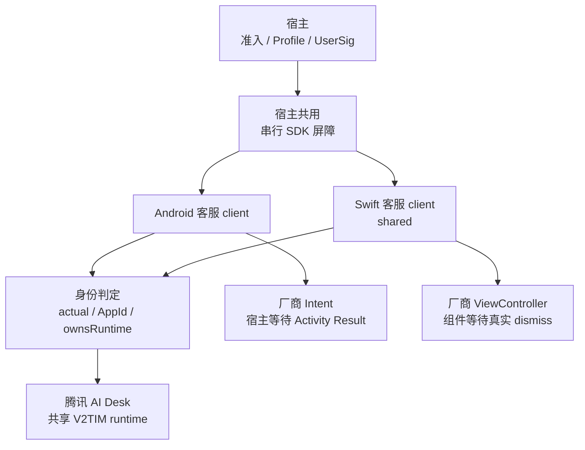
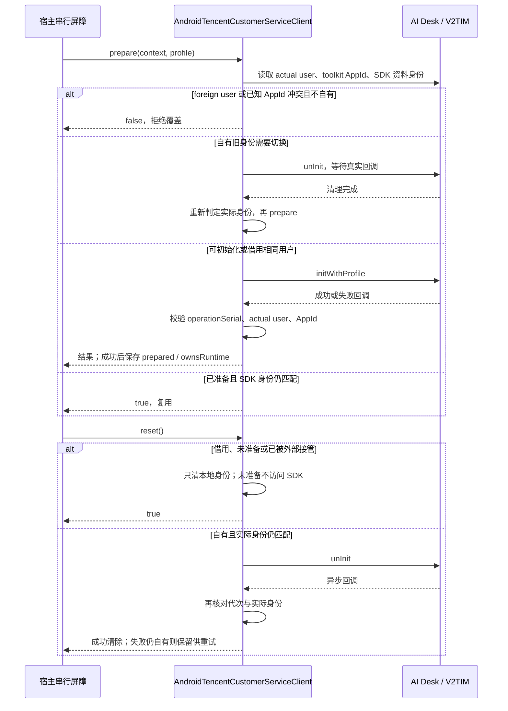
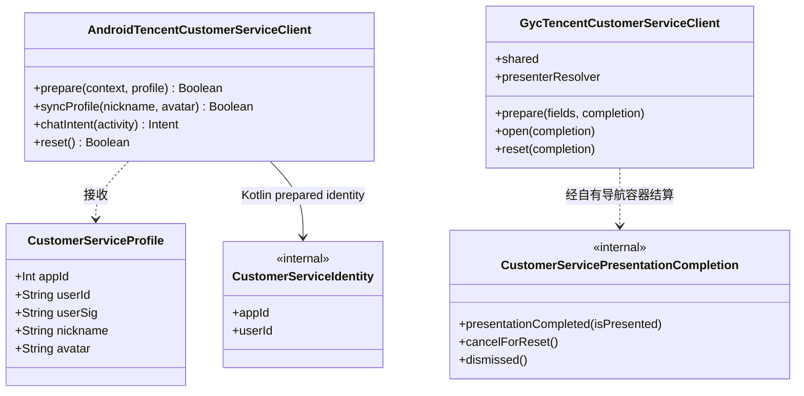

# GY CrossKit 腾讯客服适配

2026-10-08 功能索引：根KMP提供资料/Android client，iOS Git Pod提供Swift client；CMP/Kuikly宿主调用原生vendor页面，库没有独立聊天UI，OHOS客服排除。 详见[功能与平台差异](docs/功能与平台差异.md)，含固定基线、五入口矩阵、真实回归与未验收范围。当前发布组合：Maven 0.1.6；未变GycCustomerServiceNative Git Pod继续0.1.5。各渠道消费与设备验收分别核对。

最终核对（2026-10-08）：本轮重跑生产Android/Swift回调合同，vendor/UIKit为替身；真实聊天/云身份/视觉未验。 逐项时点与边界见[验证范围](docs/功能与平台差异.md#sdk系统与真实验证范围)。

Android/iOS 腾讯 AI Desk 的最小原生适配：配置厂商 UI、准备账号、同步资料、取得或展示厂商聊天页面、清理自有身份。
聊天 UI 与资源全部使用厂商依赖，组件不复制 vendor 源码或资源。Android 2.6.0 的 `initWithProfile` 会将主题重置为 vendor 的 `business` 默认；组件不再预设会被覆盖的 `finance`。品牌主题如需配置，由宿主在 `prepare` 成功后通过厂商 API 设置；这不代表 Android/iOS 厂商 UI 已视觉对齐。OHOS当前没有实现，按本轮用户要求排除；五入口表中E表示excluded，不能把排除项统计为平台验收失败。

`syncProfile` 在 SDK 回调后重新校验代次、实际身份和已知 AppId，拒绝 reset 或外部接管后的迟到成功。源码与渠道证据见[完整源码审查](verification/完整源码审查.md)，OHOS 调研见[腾讯客服鸿蒙接入核查](verification/腾讯客服鸿蒙接入核查.md)。

## 架构与调用流程

宿主先完成业务准入并取得凭据，再通过进程级串行屏障调用组件；屏障由宿主与 Live 共用。组件区分「已准备身份」与「是否拥有 SDK runtime」，避免清理其他模块借给客服的 IM 登录。



下面画 Android 的准备与清理。prepare、syncProfile、reset 在 Main + NonCancellable 等待 SDK 真正回调；调用方取消自身等待也不能提前释放共用屏障。iOS 使用主线程 completion，遵循相同身份规则。



核心类型只列组件自己的类型；Android 读取 Kotlin `CustomerServiceProfile`，Swift `prepare` 接收对应字段，内部持有独立的同名 Swift `CustomerServiceIdentity`，并非图中的 Kotlin 类型。Swift 模态 completion 仅在真实关闭后结算，照片等子页面不能提前解锁；`reset` 先关闭自有模态页再判定 SDK 清理资格。



源码入口：[Kotlin 资料与身份判定](src/commonMain/kotlin/io/github/gycrosskit/customerservice/CustomerServiceProfile.kt)、[Android 原生适配器](src/androidMain/kotlin/io/github/gycrosskit/customerservice/AndroidTencentCustomerServiceClient.kt)、[Swift client](ios/Sources/GycCustomerServiceNative/GycTencentCustomerServiceClient.swift)、[Swift identity](ios/Sources/GycCustomerServiceNative/CustomerServiceOwnership.swift)、[真实 dismiss completion](ios/Sources/GycCustomerServiceNative/CustomerServicePresentationCompletion.swift)。OHOS 没有客服实现；页面等待、超时、业务结果与直播资料恢复由宿主负责。

## 安装与消费

包装代码使用 [Apache-2.0](LICENSE)；[GitHub 仓库](https://github.com/gycrosskit/customer-service) 通过不可变标签和 Release 发布。
KMP 坐标是 `com.github.gycrosskit.customer-service:customer-service:0.1.6`；Android 最低 API 24、iOS 原生最低 15.0。
KMP root 提供数据类型与 Android 原生适配器；iOS Swift 客户端单独用 `GycCustomerServiceNative` Pod，不要求宿主再导出未消费的 KMP Bridge。

```kotlin
// 在 dependencyResolutionManagement.repositories 中添加 maven("https://jitpack.io")。
implementation("com.github.gycrosskit.customer-service:customer-service:0.1.6")
```

```ruby
pod 'GycCustomerServiceNative', :git => 'https://github.com/gycrosskit/customer-service.git', :tag => '0.1.5'
```

本地验证先执行 `bash scripts/export-artifacts.sh`，解包 `build/release/customer-service-maven.tar.gz`
到独立临时 Maven 仓库，通过仓库外的 init script 对候选模块做精确 exclusiveContent；不用 `includeBuild`、源码替换或永久 `mavenLocal`。
iOS 正式验证从上面的 Git/tag Pod 下载 Swift 源码并编译独立消费工程；不使用本地 path。
各版本冻结归档、Release 下载与远程消费记录见[发布验收](verification/发布验收.md)和[完整源码审查](verification/完整源码审查.md)；历史证据不代算当前版本。
`jitpack-install.sh` 从同版本 GitHub Release 下载 Maven 归档并校验 SHA-256，供 JitPack 安装 macOS 产物。
归档不是宿主 Maven 地址；正式消费仍使用上面的 JitPack 坐标。

## 宿主边界

宿主先校验隐私、功能、门店绑定、账号、动态 AppId 与品牌回退，并提供 UserSig、客服昵称和头像。
Android 的进程唯一 `AndroidTencentCustomerServiceClient` 接收 `CustomerServiceProfile`，在主线程执行 SDK 操作；
`onSdkError` 交回 operation/code/message 供宿主原 Logger 记录，组件不引入日志框架。
组件用共享 V2TIM actual user 判定 runtime，prepared identity 与 ownsRuntime 分开：同目标用户已经由 Live 登录时可准备并借用，不取得 logout/unInit 权限；只有本组件从空 runtime 登录成功且实际用户仍匹配才清理。foreign 用户、已知 toolkit AppId 冲突拒绝覆盖，迟到成功回调再次校验实际用户与本地代次，失败且仍自有时保留归属。Android 不再把 Desk.hasLoginSuccess=false 误当成共享 IM 未登录。
未准备身份的 reset 直接成功，不访问厂商单例；iOS 仍先关闭本组件拥有的模态页，再决定是否需要 SDK 清理。
两端在异步 reset 成功后重新判定 SDK 实际用户，避免等待期间外部接管的账号被覆盖。

同步资料与打开页面也核对已知 Desk AppId，拒绝外部切换到另一 AppId 的同名用户；合法借用允许使用页面和同步资料，但不取得清理权限。SDK getter 未知时仍由宿主统一配置保证。

两端直接读取 Desk 的 `TUILogin.getSdkAppId()` / `TDeskLogin.getSdkAppID()` 配置缓存保护已知冲突。V2TIM 没有公开全局实际 SDKAppID getter；组件不能从 userId 证明凭据完全相同，宿主须统一 Live/客服腾讯 SDKAppID。已知 AppId 与旧 prepared 身份不符时，即使同 userId 也不允许 reset/unInit 或恢复旧权限，mayOwn 沿用同一判定。相同用户的外部注销再登录没有 owner token，本地记录不能保证跨任意外部调用的排他 ownership。

prepare、syncProfile、reset 是不可取消的厂商操作。宿主必须用进程级串行任务持有至 SDK 真正回调，
调用方超时或取消只结束自身等待，不能通过重建 client、创建第二 scope 或新会话绕过旧操作。Live 与客服必须复用宿主已有同一个 SDK 操作屏障；这是串行不可取消 native 调用，不能替代组件 actual/own/borrow 保护。
Android `chatIntent` 只取得原生页面，Activity Result 与重复打开等待由宿主持有。
iOS 唯一 `GycTencentCustomerServiceClient.shared` 接收最终活动容器的 `presenterResolver`，
展示厂商 ViewController，并在真实 dismiss 后回调；照片等全屏子页不提前解锁。
宿主只转发 native completion，继续负责业务结果、等待及直播资料恢复。

## 固定厂商依赖与来源

Android `com.tencentcloud.desk:aideskcustomer:2.6.0` 及其 Desk 2.6.0 组件；IM 固定 `imsdk-plus:9.1.7818`。
iOS `TencentCloudAIDeskCustomer:1.4.1`、TDesk 四组件 `2.9.141`、IM `TXIMSDK_Plus_iOS_XCFramework:9.1.7818`。
厂商通过 Maven/CocoaPods 原坐标取得，不嵌入归档，不替换聊天 UI。
Android 缓存 POM 的许可证字段是 Apache-2.0；iOS Podspec 与原 LICENSE 是 MIT。
本仓库包装代码使用 Apache-2.0；厂商依赖继续使用其原许可证及服务条款。
Release Maven 归档仅含本组件的 AAR/KLIB/metadata；Native 0.1.0 归档仅含本组件 Swift 源码、Podspec、README 和 LICENSE。

## 验证

```bash
bash gradlew testDebugUnitTest compileKotlinIosSimulatorArm64 publishAllPublicationsToStagingRepository
mkdir -p build/verification
swiftc ios/Sources/GycCustomerServiceNative/CustomerServiceOwnership.swift ios/Sources/GycCustomerServiceNative/CustomerServicePresentationCompletion.swift verification/main.swift -o build/verification/ownership-check
build/verification/ownership-check
```

独立消费工程见 `verification/gradle`，正式验证通过 exclusiveContent 仅从 JitPack 消费本组件。
发布提交、归档 SHA-256、历史验证命令及边界见[发布验收](verification/发布验收.md)；当前测试入口与执行范围见[功能与平台差异](docs/功能与平台差异.md#sdk系统与真实验证范围)。单测与编译不能替代实际登录、聊天、同 IM 直播账号共存、账号切换和真机生命周期验收。

## 自动回归

[Source regression](.github/workflows/regression.yml) 按事件分阶段：PR 先判断变更范围，仅源码变更运行已有 Android/Native 测试与编译；纯文档 PR 和 `main` push 只运行轻量脚本/配置检查。手动运行不填版本时执行源码回归，未知路径保守按源码处理。线上执行结果与耗时以实际 Actions 运行为准。

[Release validation](.github/workflows/release-validation.yml) 在 Maven Release 发布或手动填写精确已发布版本时，`verify-public` 统一校验一次冻结归档、精确 tag/commit、完整 publication 清单和公开文件；通过后 Android/Native 独立消费者从 JitPack 解析该版本。PR 不再反复消费旧基线；不使用 `mavenLocal`、本库源码或归档替换远程依赖。此流程不发布二进制。

GitHub-hosted runner 的实际结果以 Actions 为准；没有 DevEco/ohpm runner，因此 HAR 构建、ohpm Registry 安装、完整原生 SDK 集成和真机业务验收仍按既有验证文档执行，不能由这些 job 的成功代算。

阶段、缓存、有限网络重试、失败记录与证据边界见[共用 CI 规则](https://github.com/gycrosskit/.github/blob/main/docs/持续集成门禁.md)；本库实际平台命令以 workflow 为准。源码通过、远程消费、HAR/ohpm 与设备验收分别记录。

公网核验同步组织 `templates/check-public-maven.py`：使用冻结归档给出的完整 publications 清单，核对 JitPack tag/commit、每个公开 POM/Module、全部声明变体字节大小和四类哈希、内部精确版本及 `available-at`；MD5/SHA-1 sidecar 必须匹配。SHA-256/SHA-512 sidecar 的 HTTP 404 单独输出为渠道缺失，不计为校验通过。
